# Purpose Statement

_"A smart phone application and martial arts body armour equipment are designed, programmed, 
assembled, and tested on the basis of cost, sustainability, durability, and manufacturability 
for the purpose of enhancing martial artist’s training regiments within the boundaries of the 
Android platform, closed source software, and client requirements."_

# Client Requirements

- At least one "training mode" (a time-selectable round)
- At least one "game mode" (a mode which has pre-defined limitations, and which focuses one area of discipline)
- Records force measurements to some degree of accuracy and repeatability (real-world units were not a requirement)
- No wearables aside from the body armour equipment that was provided to us 
- Strikes only needed to be recorded at the center of the armour, where the internal fiberglass shielding was located 
- The software would not be available to the public i.e., closed-source

# Project Goals

The project team had a few internal goals for the mobile application:

- __Simple (KISS):__ The application would target a wide age-range, thus, a simple user experience was a key indicator of success
- __Visually appealing:__ The previous project team's application failed (in our opinion) at creating
a UI design that was visually appealing. We wanted to remedy this.
- __Doing things the "proper" way:__ Proper code is a subjective concept. We defined "proper" code to
mean closely following Android's own guidelines and documentation. Cobbled together hacks were a no-go.
This also meant using well-established libraries where possible. The hope was to make our code as
readable and future-proof as possible!

# Challenges

# Results

    
    
    
    

### Dashboard/Home Page

 
 

    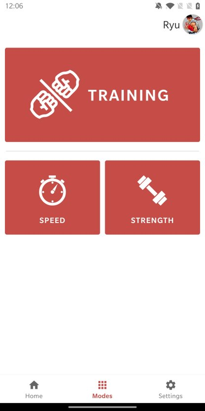
    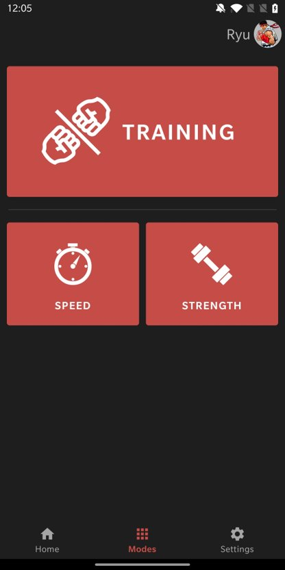
    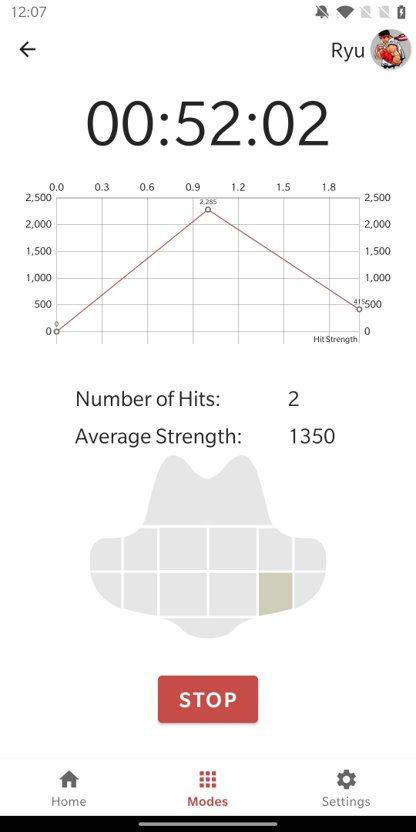
    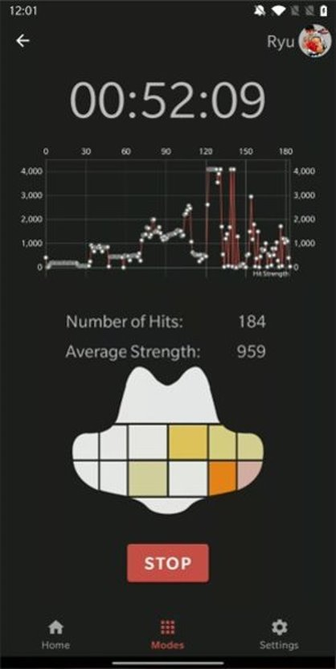

### Modes Selection Page and Training Mode

 
 

    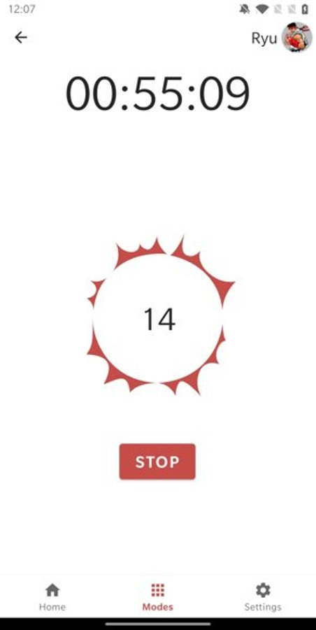
    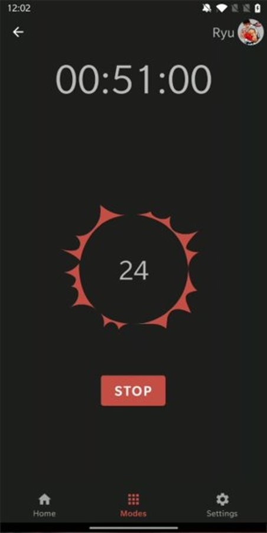
    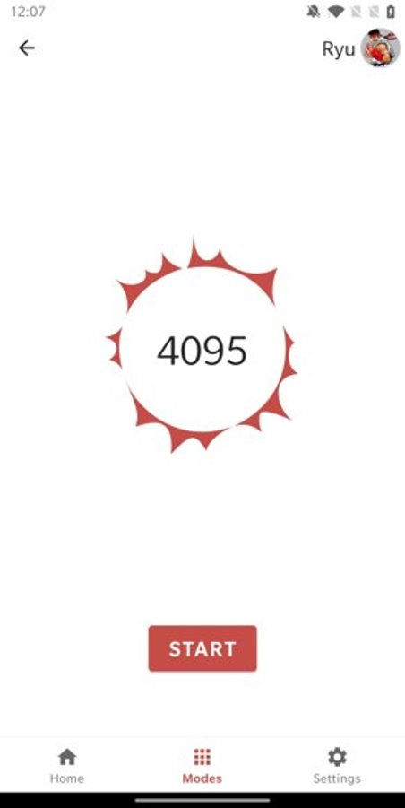
    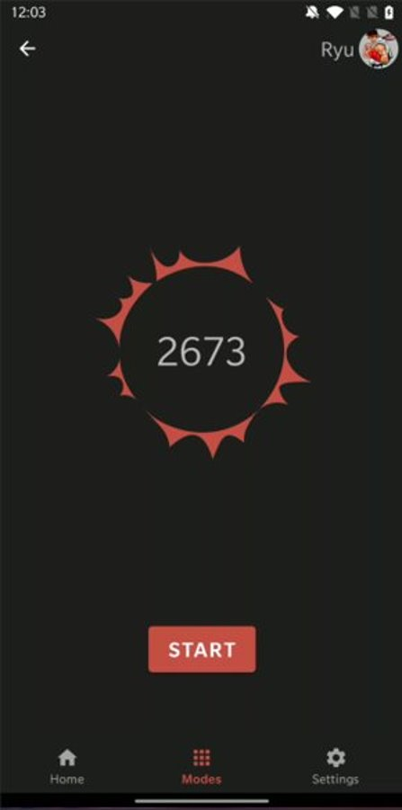

### Speed Mode and Strength Mode

 
 

    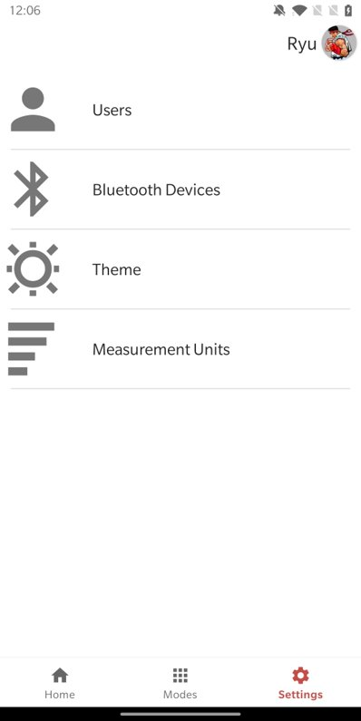
    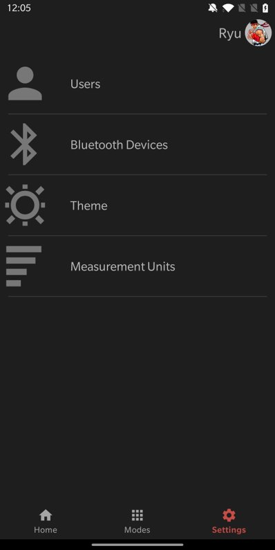
    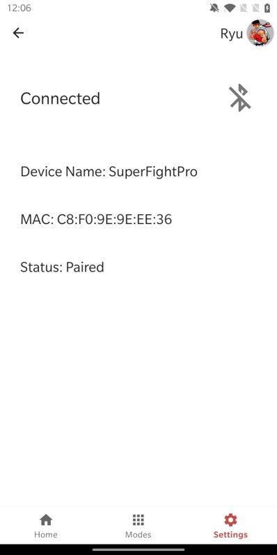
    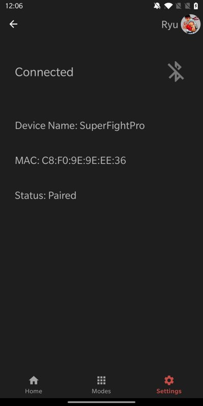

### Settings Page and Bluetooth Connection Page

 
 

    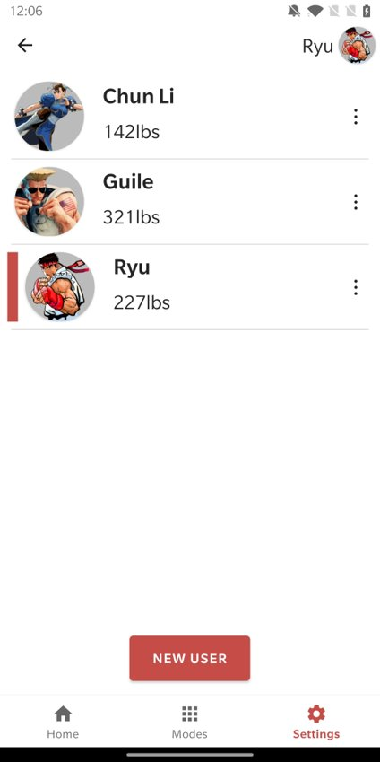
    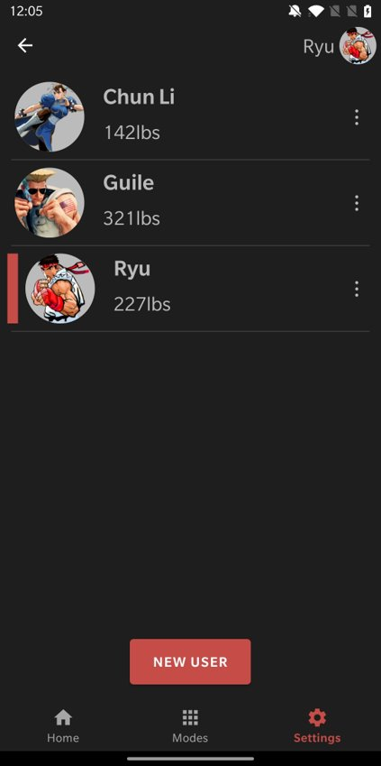
    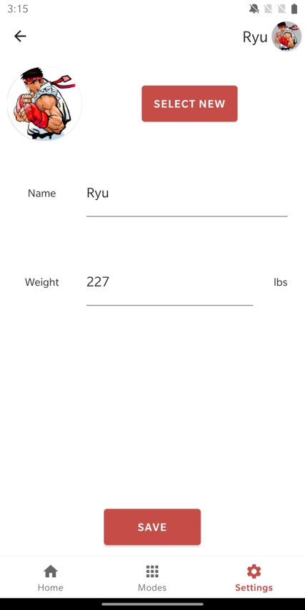
    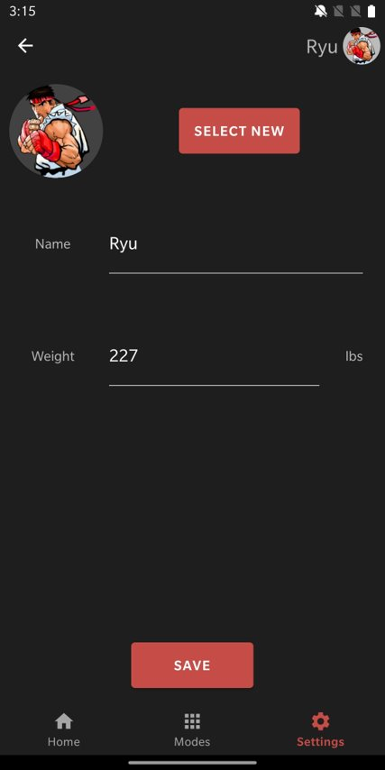

### User Select Page and User Creation Page

# Conclusion
